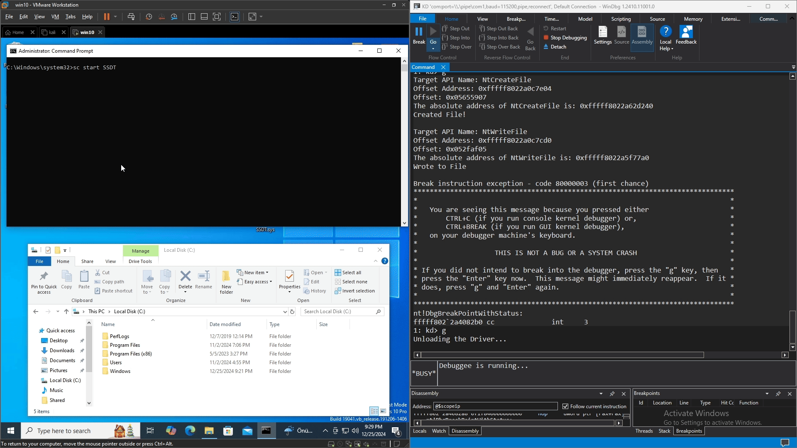

## Using SSDT

This project simply demonstrates how to call the API using the SSDT (System Service Dispatch Table) in a Windows kernel driver.

The goal of this project is to show how to interact with system services (like NtCreateFile and NtWriteFile) by directly accessing the SSDT, which contains the addresses of these system routines.

## How It Works

- **SSDT Address and Service Numbers:** The SSDT is a table in the kernel that maps system calls (APIs) to their actual implementation addresses. To interact with a system service like NtCreateFile, we need to know the address of the SSDT and the index (known as the SSN) of the service. In this project, the SSDT address is defined manually (KiServiceTableAddress) based on a value that can be fetched using a debugger (like WinDbg). The Service System Number (SSN) for specific functions like NtCreateFile and NtWriteFile is also defined.

- **Getting the Absolute Address of a Service Routine:** The function GetAbsoluteAddress is used to calculate the absolute address of a system routine by reading the SSDT and the corresponding offsets. This is done using the provided SSN and the SSDT address. The absolute address allows us to make direct calls to the system function.

- **File Operations Using SSDT:** The main objective of the driver is to demonstrate file operations by using the NtCreateFile and NtWriteFile services. These system calls are used to create and write to a file in kernel mode.

## `⚙️` Required Modifications Before Running the Project

There are variables in the Project that need to be set manually. One is the address of the SSDT table and the other SSN numbers:

```c
#pragma warning(disable: 4083 4005)
#include "main.h"

#define KiServiceTableAddress 0x0

#define SSN_NtCreateFile 0x55
#define SSN_NtWriteFile 0x8
```

You can use windbg to get these values. In particular, if you do not append the address of the SSDT table properly, you will get a BSOD error.

## `🎥` Video



## `🚨` Disclaimer

This project is developed for educational purposes only. The project focuses only on explaining how to call the API directly using the SSDT table. 

Usage in real-world scenarios is at your own risk. The author is not responsible for any damage, misuse, or legal consequences that may arise from using or distributing this project.
